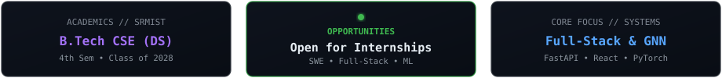

<div align="center">

  <!-- Terminal System Info Header -->
  

  <br/><br/>

  <!-- Status / Highlights Cards -->
  

  <br/><br/>

  <!-- Quick Links & Contact Pills -->
  <a href="https://debjitttt-ross.vercel.app/" target="_blank">
    
  </a>
  &nbsp;
  <a href="https://www.linkedin.com/in/debjit-das-6b0452327/" target="_blank">
    
  </a>
  &nbsp;
  <a href="https://leetcode.com/u/debbjitttt/" target="_blank">
    
  </a>
  &nbsp;
  <a href="mailto:debjitsince90908@gmail.com">
    
  </a>

</div>

<br/>

---

### `// 01. FEATURED PROJECT`

```bash
$ ls -la ~/projects/openzess
```

#### ⚙️ [Openzess](https://github.com/rosdebbu/openzess)
> **Autonomous Agent Platform & Open Hardware Toolkit**
- Full-stack autonomous agent platform with React dashboard, FastAPI backend, and PostgreSQL (Neon).
- Real-time WebSocket matrix viewer, automated cron reporting, and codebase knowledge graph analysis.
- **Tech Stack:** `TypeScript` `React` `Python` `FastAPI` `PostgreSQL` `WebSockets` `Docker`

<br/>

---

### `// 02. RESEARCH & SYSTEMS`

```bash
$ cat ~/research/active.md
```

- 📄 **Graph Neural Networks (GNN)** — Academic research into spectral graph theory, message-passing neural networks, and graph-based representations for structured data.
- 🦯 **ESP32 Smart Sensing Prototype** — Embedded hardware/software system for real-time environmental monitoring with sensor fusion and wireless telemetry.
- 🌊 **Computational Fluid Dynamics (CFD)** — OpenFOAM wave simulations in Linux with custom mesh generation and ParaView post-processing.

<br/>

---

### `// 03. GET IN TOUCH`

```bash
$ echo "Always open for collaborations, research discussions, and internship opportunities!"
```

<div align="center">

[](https://debjitttt-ross.vercel.app/)
&nbsp;&nbsp;
[](https://www.linkedin.com/in/debjit-das-6b0452327/)
&nbsp;&nbsp;
[](https://leetcode.com/u/debbjitttt/)
&nbsp;&nbsp;
[](mailto:debjitsince90908@gmail.com)

<br/>

<sub>⚡ Crafted with code &amp; care by **Debjit (Ross) Das** • 2026</sub>

</div>
