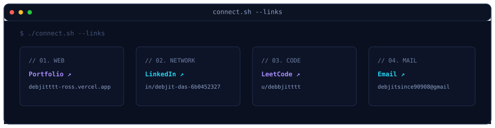

  <picture>
    <source media="(prefers-color-scheme: dark)" srcset="./assets/terminal.svg">
    
  </picture>

# Hi there! 👋

I'm **Debjit (Ross) Das** — a **B.Tech CSE (Data Science)** student at **SRMIST** and full-stack developer building production systems and researching Graph Neural Networks (GNNs). Currently building, learning, and shipping. 🚀

  

  

  
  &nbsp;
  
  &nbsp;
  
  &nbsp;
  

 

<h3>Currently Building</h3>

### ⚙️ [Openzess](https://github.com/rosdebbu/openzess)
*Autonomous Agent Platform & Open Hardware Toolkit — a production-grade full-stack system with a React dashboard, FastAPI backend, PostgreSQL (Neon) with connection pooling, WebSocket matrix viewer, automated cron reporting, and codebase knowledge graph analysis.*

  
  
  
  
  
  

 

<h3>Research & Systems</h3>

- 📄 **Graph Neural Networks (GNN)** — Academic research into spectral graph theory, message-passing neural networks, and graph-based representations for structured data.
- 🦯 **ESP32 Smart Sensing Prototype** — Embedded hardware/software system for real-time environmental monitoring with sensor fusion and wireless telemetry.
- 🌊 **Computational Fluid Dynamics (CFD)** — OpenFOAM wave simulations in Linux with custom mesh generation and ParaView post-processing.

 

  ⚡ Designed with terminal aesthetics • **Debjit (Ross) Das** • 2026

